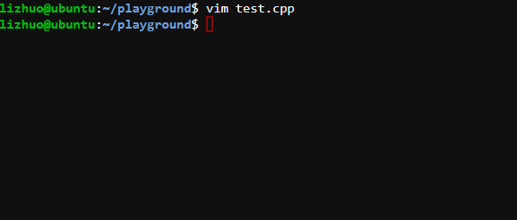

# Build C/C++ Environment with VS Code

在这个教程中，你将学会用Visual Studio Code搭建C/C++开发环境。

Visual Studio是微软开发的一款强大的编辑器，注意是编辑器而不是IDE（集成开发环境），所以他的基本功能跟记事本差不多--就是编辑代码，而无法编译和运行。但是VS Code强大的地方在于它支持很多插件，而且非常轻量级。

## 运行C/C++代码

运行C/C++代码可以简化为两个步骤：

1. 编译

    C/C++代码是方便人阅读和编写的高级语言，而计算机只能执行二进制代码，所以要把文本编写的C/C++代码编译成可执行代码。

2. 执行

   执行编译得到的二进制代码。

下面是在linux上进行上面两个步骤的图示。




```bash
g++ test.cpp -o test.out
```

g++ 是GNU系列的c++编译器，这一行命令将test.cpp编译生成可执行文件test.out

我们配置的开发环境大致也要完成这些工作，但是我们的需求不仅仅是运行，还需要调试，比如设置断点，跟踪调用堆栈等操作，所以除g++之外我们还需要gdb。

下面就VS Code环境展开详细的配置步骤。

## 安装编译器

对于非linux环境，GNU编译器不是内置的，需要安装，最常用的是Mingw（其他可用的也有clang）

安装Mingw-w64可参照下面的步骤，如果安装的版本是Mingw32，需要注意勾选gcc, g++和gdb.

*Gcc is short for GNU C Compiler. G++ is for c++ cmopiler. Gdb is short for GNU Debugger.*

### MinGW Installation | MinGW安装

1. Download MinGW from the [source forge](https://sourceforge.net/projects/mingw-w64/files/mingw-w64/mingw-w64-release/).

    从[官网](https://sourceforge.net/projects/mingw-w64/files/mingw-w64/mingw-w64-release/)下载MinGW。


2. Install MinGW. Choose newest version. Choose the right architecture according to your system WORD.(i686 for 32 bits system and x86_64 for 64 bits system) Wait.. Until the progress complete.

    安装MinGW。选择最新的版本，按照系统的位数选择正确的体系结构。（32系统位选择i686，64位系统选择x86_64）等待下载器下载和安装。

    安装好后，是不是就结束了？不是。

    我们成功地获得了编译器 /path/to/mingw/bin/g++.exe。但是我们希望编译时只要敲g++，而不是输入整个路径，所以我们把路径添加到环境变量的PATH中。这样，系统在读到命令g++时，就从环境变量里的路径下去搜索，就可以找到g++.exe这个文件了。

    

3. Add path. Right click ''My Computer'' and select ''Properties -> Advanced Setting -> Advanced -> Environmental Variables''.  Put the absolute path of ''bin'' in mingw64 into the path list.

    添加环境变量。右键单击“我的电脑”，选择“属性->高级系统设置->高级->环境变量”，将mingw64目录中的bin子目录放入列表中。


4. Open command line console, and input ''gcc -v'' command.

   打开命令行窗口，输入“gcc -v”命令。

   这一步是为了测试安装和添加环境变量是否成功，如果失败，就会得到gcc command not found类似的错误。


## VS Code 环境配置

### Visual Studio Code Installation

先安装VS Code。

Download Visual Studio Code(VS Code) from the [official website](https://code.visualstudio.com/).

Choose version according to your operating system.(Stable and Insiders are both Okay.)


### VS Code Extension Installation

安装必要的插件（类似于外挂功能），这样VS Code将不再是记事本....

"C/C++"是开发C/C++必需的插件，"C++ Intellisense"支持自动补全功能，在代码编写中非常重要。

Click the Extension button at left side.

Search "c++".

Install "C/C++" and "C++ Intellisense".


### VS Code Configure

1. Create an empty folder to hold your code. (eg. "C:\Users\***\Documents\WorkSpace\Code")

   Open this folder from VS Code.
   
   先进行准备工作，VS Code的环境以目录为单位，我们创建一个存放代码的目录，以后我们编写代码都将在这个文件夹中进行。在VS Code中打开这个目录之后，这就是我们的工作环境了。


2. Create a demo cpp file for test.

   在这个目录下新建一个cpp文件。

```cpp
#include <iostream>
using namespace std;

int main()
{
	cout << "Don't say hello world again." << endl;
	return 0;
}
```


3. Add task configuration for compile and debug. Choose "Default Configuration".

   这里是配置环境中最关键的地方，我们希望按下运行键后，VS Code就帮我们完成编译、运行的操作。所以我们需要一个配置文件来告诉按下运行键后，VS Code应该怎么怎么做。

   这就是launch.json的内容。


Then we have generated a file -- "launch.json".

"launch.json"将告诉VS Code配置的详细信息；比如：

```json
"program": "运行的程序名"
"miDebuggerPath": "调试器(gdb)的路径"
```

以之前的操作为例，如果我们填上"test.out"和"/path/to/mingw/gdb"，按下F5之后，VS Code将进行的操作是执行命令：

```bash
gdb test.out
```

问题是我们还没有编译，所以我们加上"preLaunchTask"，意思是在Launch之前，先执行这个task. 把这个task命名为"compile"（当然，可以是任何你喜欢的）


Modify "enter program name, for example \${workspaceFolder}/a.exe" to "​\${file}.out".

Modify "/path/to/gdb" to gdb path which you have added to System PATH.

Modify "externalConsole" to "true".

Add one line: 	

```text
"preLaunchTask": "compile",
```


Go back to your code and press F5. You will get error message as following:

我们回到代码，按F5之后，会报错说我们没有配置任务"compile"。我们只告诉VS Code在Launch之前先执行任务"compile"，还没有说明"compile"任务是什么，所以我们下面配置任务"compile".


Click "Configure Task". Choose "Create tasks.json file from template". Choose Others.


接下来就是"compile"任务的配置，"label"就是你在上一步填的名字"compile"。

主要的命令是：

```bash
g++ ${file} -o ${file}.out
```

\${file}会匹配你当前编辑的文件名，命令将\${file}编译输出为\${file}.out

其他的细节可以暂时先不关注。

Copy the following code to "tasks.json":

```json
{
        // See https://go.microsoft.com/fwlink/?LinkId=733558
        // for the documentation about the tasks.json format
        "version": "2.0.0",
        "tasks": [
            {
                "label": "compile",
                "type": "shell",
                "command": "g++",
                "args": [
                    "-g",
                    "-std=c++14",
                    // "-lpthread",
                    "\"${file}\"",
                    "-o",
                    "${file}.out"
                ],
                "presentation": {
                    "reveal": "always",
                    "panel": "shared",
                    "focus": false,
                    "echo": true
                },
                "group": {
                    "kind": "build",
                    "isDefault": true
                },
                "problemMatcher": {
                    "owner": "cpp",
                    "fileLocation": "absolute",
                    "pattern": {
                        "regexp": "^(.*):(\\d+):(\\d+):\\s+(error):\\s+(.*)$",
                        "file": 1,
                        "line": 2,
                        "column": 3,
                        "severity": 4,
                        "message": 5
                    }
                }
            }
        ]
}
```

这样我们的配置就到此完成了。

Go back to your code, add a breakpoint and Press F5 to run your program !


Now you have successfully run your first program.

Next time you want to enjoy coding, create and edit a cpp file in this folder. And then you can press F5 to run it directly. Yeah, simple and quick !